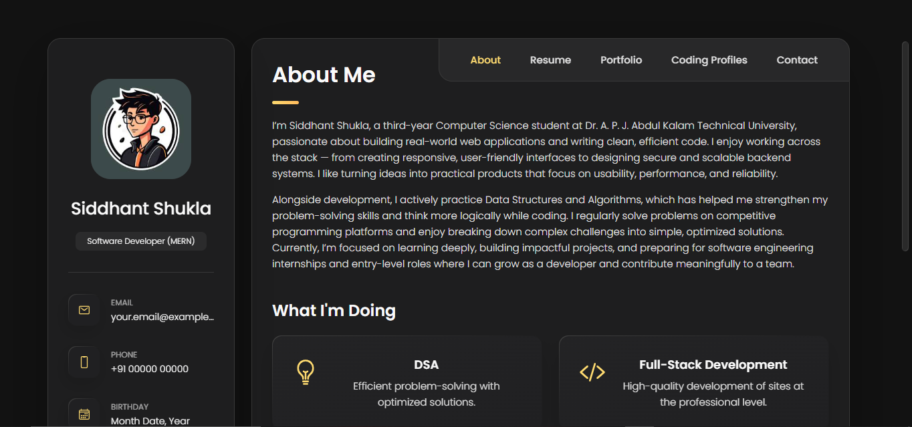

# 🚀 Portfolio 2.0

A modern, responsive personal portfolio website showcasing my skills, projects, and experience as a Full-Stack MERN Developer.

🌐 **Live Demo:** [View Portfolio](https://siddhantshukla108.github.io/Portfolio2.0)

---

## 📸 Preview



---

## ✨ Features

- 🎨 Clean and modern UI/UX design
- 📱 Fully responsive across all devices
- ⚡ Smooth animations and transitions
- 🧩 Sections: Hero, About, Skills, Projects, Contact
- 📬 Functional contact form
- 🌙 (Optional) Dark/Light mode toggle

---

## 🛠️ Tech Stack

| Technology | Purpose |
|---|---|
| **React.js** | Frontend UI framework |
| **HTML5 / CSS3** | Markup & Styling |
| **JavaScript (ES6+)** | Logic & Interactivity |
| **Tailwind CSS / CSS Modules** | Styling |
| **Framer Motion / GSAP** | Animations |
| **EmailJS** | Contact form integration |

> _Update the table above to match your actual tech stack._

---

## 📂 Project Structure

```
Portfolio2.0/
├── public/
│   └── index.html
├── src/
│   ├── assets/          # Images, icons, fonts
│   ├── components/      # Reusable UI components
│   ├── sections/        # Page sections (Hero, About, etc.)
│   ├── App.jsx
│   └── main.jsx
├── package.json
└── README.md
```

---

## 🚀 Getting Started

### Prerequisites

- Node.js (v16 or higher)
- npm or yarn

### Installation

1. **Clone the repository**
   ```bash
   git clone https://github.com/siddhantshukla108/Portfolio2.0.git
   cd Portfolio2.0
   ```

2. **Install dependencies**
   ```bash
   npm install
   ```

3. **Start the development server**
   ```bash
   npm run dev
   ```

4. **Open your browser**
   ```
   http://localhost:5173
   ```

### Build for Production

```bash
npm run build
```

---

## 📬 Contact

**Siddhant Shukla**

- 🐙 GitHub: [@siddhantshukla108](https://github.com/siddhantshukla108)
- 💼 LinkedIn: [linkedin.com/in/siddhantshukla108](https://linkedin.com/in/siddhantshukla108)
- 📧 Email: devyne0108@gmail.com

---

## 📄 License

This project is open source and available under the [MIT License](LICENSE).

---

> ⭐ If you found this portfolio inspiring, consider giving it a star!
